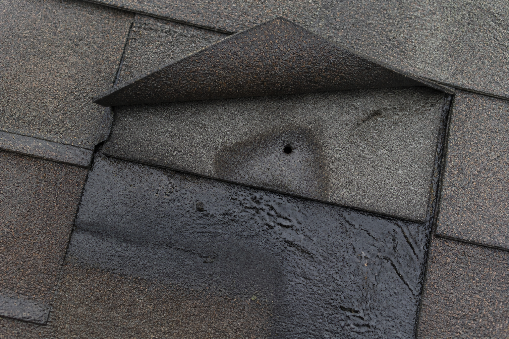
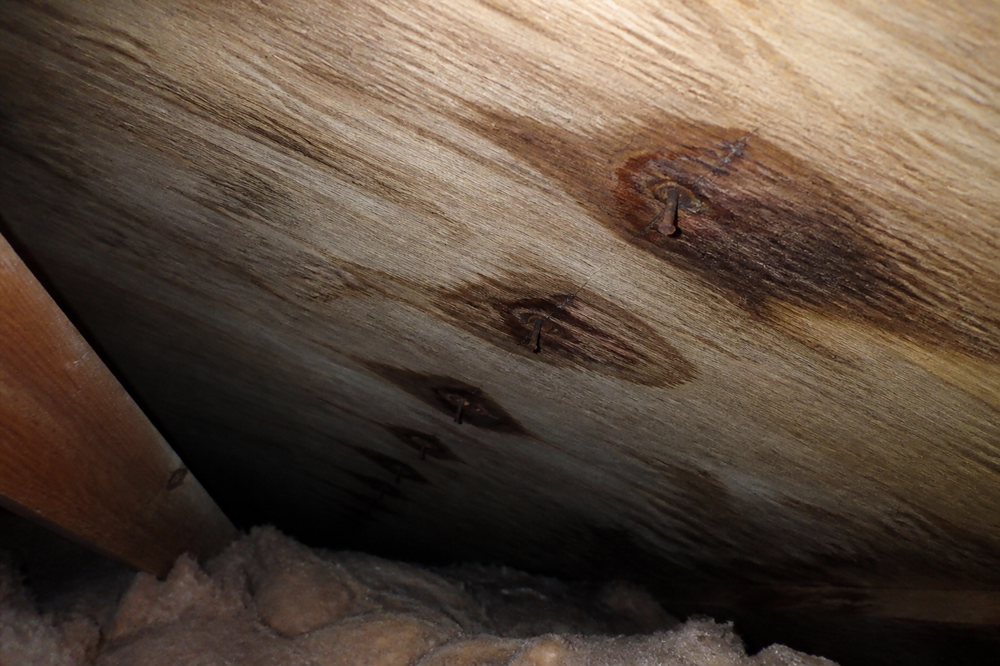

We repair roofs for a living the other ten months of the year. A predictable share of that work traces back to something that was screwed, nailed, or stapled to a roof in November and forgotten about.

Christmas lights are the most common version. Not because homeowners are careless — because a shingle looks like a solid object, and putting a fastener through a solid object feels like a small thing.

It isn't a solid object. That's the whole problem.

## An asphalt roof is a system for moving water, not a barrier

This is the part almost nobody gets told, and everything else follows from it.

Asphalt shingles are not waterproof. They are *water-shedding*. Each course overlaps the one below it so that water landing anywhere on the roof is always being handed downhill to the next shingle, then the next, and finally into the gutter. The roof stays dry because the water never gets a chance to stop moving.

Nails belong in a specific horizontal band on each shingle — the nail line — precisely because the course above covers that band. Every fastener the manufacturer intends is a fastener that ends up underneath something else.

A staple driven wherever the light clip happened to sit is not in that band. It is out in the open, in the middle of the exposure, with nothing above it.

**And it is usually two holes, not one.** A staple has two legs, and at typical shingle exposure it is long enough to pass through the shingle you can see *and* into the top of the course beneath it. One casual squeeze of a staple gun, four punctures through two layers.

## The water does not run past the hole. It stops there.

Here is where intuition fails people. A hole in the middle of a slope sounds survivable — water is running downhill, it will run past.

It doesn't, for three reasons.

**Capillary action.** The gap between two shingle layers is narrow enough to draw water sideways and upward against gravity. This is not a trickle; it is the same effect that pulls liquid up a paper towel.

**Wind-driven rain.** Rain rarely falls straight down here. When wind and rain arrive together — which in Washougal and the east county is most of the winter — water moves horizontally. Horizontal water finds openings that vertical water never touches.

**The fastener itself.** Steel and asphalt expand and contract at different rates. Every warm afternoon and cold night works the fastener slightly loose in its hole, and the hole gets marginally wider each cycle. Rust accelerates it.

*The images in this article illustrate the mechanism described. Lift the tab above a fastener and the story is written on the layer underneath — the stain rings the hole and spreads outward, because water has been sitting there rather than running past.*

## Then it has seven months

In a dry climate, a small breach might do very little. Here it gets the wet season.

Vancouver's rain runs roughly October through May. A staple driven in mid-November has about six to seven months of near-continuous moisture before anything dries out properly. Add our freeze-thaw nights — not brutal, but frequent enough — and water that has worked into the hole expands when it freezes and widens the opening a fraction each time.

Nobody is on the roof during any of this. The lights come down in January and the fastener usually stays, because pulling staples out of shingles tears them, so the fast move is to snip the wire and leave the metal in place. Now there is a rusting steel object holding a hole open through two shingle layers for the rest of the roof's life.

## Where the damage actually shows up

Not on the shingle. The shingle looks fine for years.

It shows up on the decking — the plywood underneath — and by then it has been going on for a long time.

*What a fastener line looks like from the attic side. The staining follows the spacing of the clips exactly, which is how these get identified — nothing else on a roof produces a row of evenly spaced stains.*

That evenly spaced row is diagnostic. Weather damage is random. Flashing failures are localised. A tidy line of stains at consistent intervals along an eave or a gable is a fastener line, and it means water has been reaching the deck at every one of those points.

Plywood does not recover. It stains, then softens, then delaminates. Once the deck is compromised the repair stops being a shingle job and becomes carpentry — and a section of decking has to come off, which means the shingles over it come off too.

**The sequence people experience is: nothing, nothing, nothing, then a ceiling stain and a five-figure conversation.** By the time it is visible from inside, the deck has usually been wet for two or three seasons.

## The arithmetic

Stapling lights up yourself saves the cost of hiring someone — call it several hundred dollars.

Tracing an intermittent leak is a diagnostic job before it is a repair job, because water travels along rafters and shows up somewhere other than where it entered. Then the repair. Then, if the deck is gone, the decking and the shingles above it.

That is not a scare figure, it is just the order of operations. A repair that starts with "we need to find where this is actually coming in" is never the cheap kind.

## What to do instead

**Clips. That is the entire answer.** They cost very little and they exist because this is a solved problem.

There are different clips for different edges — shingle tabs, gutters, ridges, fascia — and using the wrong one is how "the lights fell down in the first wind" happens. But every one of them grips. None of them penetrate.

Nothing about a professional install involves a fastener going into your roof. If you take one thing from this article, it is that there is no version of hanging Christmas lights that requires making a hole.

## What to ask whoever you hire

One question, and the answer tells you everything:

> **"How are you attaching them?"**

You want an immediate, specific answer about clips, and which clips for which edge. Hesitation, vagueness, or anything involving staples, nails, screws, or "we'll figure it out up there" — keep calling. It costs nothing to ask and it is the difference between a display and a deferred repair bill.

Also ask whether removal is included in writing. Lights left up past spring are a second problem: UV and rain destroy the strands, and whoever comes to rip them down in a hurry does the tearing damage that stapling set up.

## If your lights are already stapled up

This is the situation a lot of people are actually in, so:

**Do not just yank them.** Pulling staples through shingles tears the mat and turns one hole into a torn tab. If the lights are up and it is mid-winter, the least-bad option is usually to leave them until conditions are dry and mild, then have them removed carefully.

**Snipping the wire and leaving the metal is not "fine."** It is the most common thing people do and it leaves the hole permanently propped open by a rusting fastener.

**Get the attic looked at, not the roof.** You will not see this from the ground or even from a ladder. Go into the attic with a torch on a wet day and look at the decking under the eave line where the lights were. If there is a row of evenly spaced dark rings, you have your answer, and it is worth dealing with in spring rather than discovering in a ceiling.

---

*We install Christmas lights around Vancouver and Clark County on clips, with no penetrations of any kind — partly because it is the right way to do it, and partly because we are the ones who get called when somebody does it the other way. [Here is what that costs](/blog/christmas-light-installation-cost-vancouver-wa), or [see the full rate card](/christmas-light-installation-vancouver-wa).*
